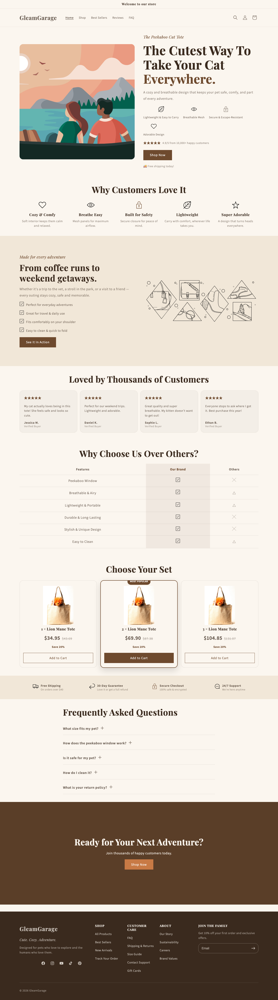
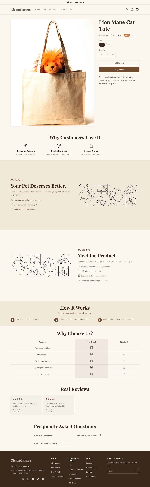
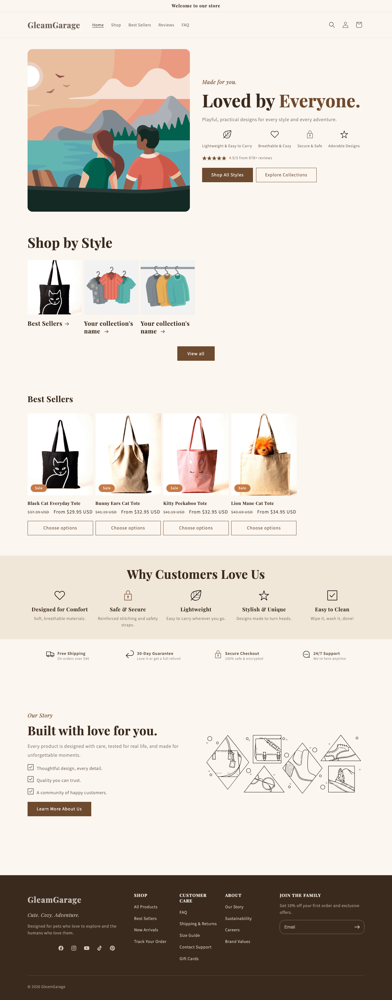
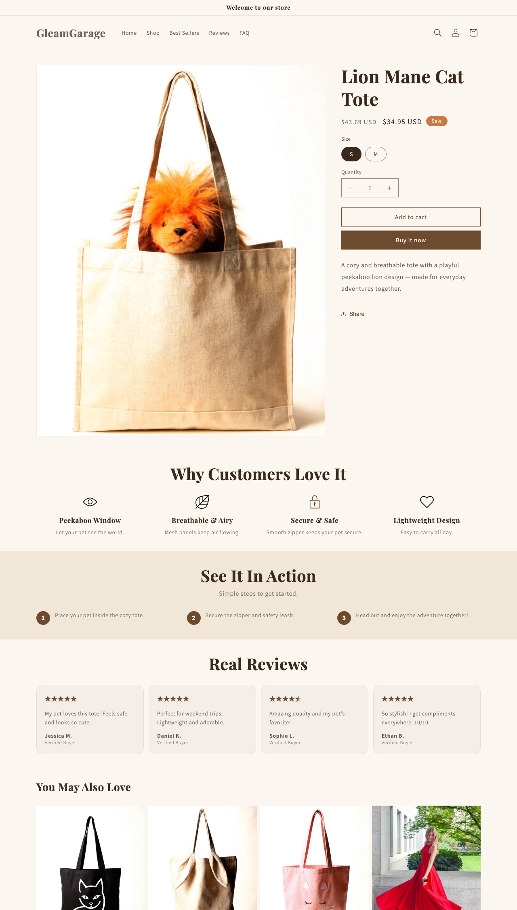
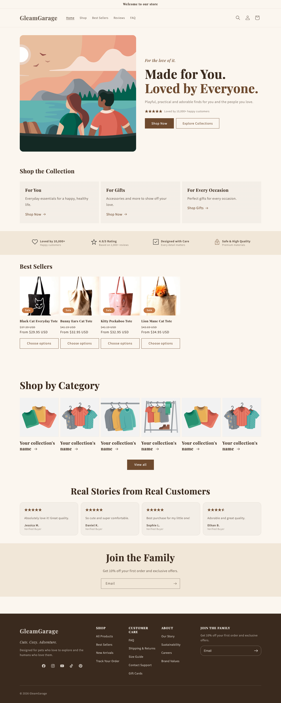
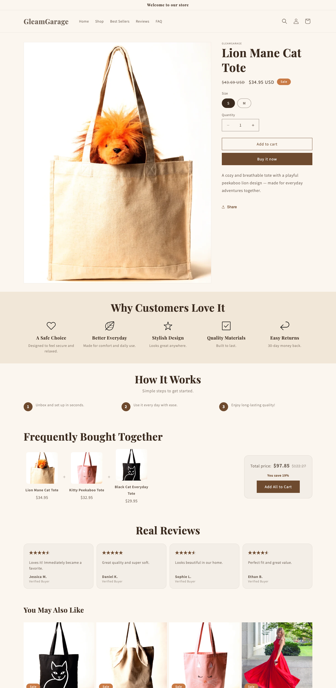

# Evidence report — V1 / V2 / V3

A snapshot of the three store types running on a demo store, captured full-page from a live
preview. For a client-facing PDF, see
[evidence/base-theme-v1-v2-v3-report.pdf](evidence/base-theme-v1-v2-v3-report.pdf).

> This is a point-in-time build snapshot used to demonstrate the three store types. The images
> below were captured on the demo store "GleamGarage".

## At a glance

Same codebase, one color scheme, one font set, one footer — the three types differ only in
their commerce structure.

| | V1 One Product | V2 Multi Style | V3 Multi Product |
|---|---|---|---|
| Focus | One hero product | Many styles/variants | Many products, one niche |
| Homepage highlight | Pricing tiers (bundles) | Shop by Style + Best Sellers | Shop by Category + product sections |
| Product page | Full landing | Variant-focused | Frequently Bought Together |
| Footer / colors / fonts | Shared (global) | Shared | Shared |

---

## V1 — One Product

Homepage: hero → benefits → story → reviews → comparison table → pricing tiers (1×/2×/3×) →
trust badges → FAQ. Product page: full landing (problem → solution → how it works → size guide →
comparison → reviews → FAQ) with metafield-driven benefits/reviews/FAQ.

| Homepage | Product page |
|---|---|
|  |  |

## V2 — Multi Style

Homepage: hero (2 CTAs) → Shop by Style → Best Sellers → benefits → trust → story.
Product page: variant-focused buy area → social proof → benefits → See It In Action → size
guide → reviews.

| Homepage | Product page |
|---|---|
|  |  |

## V3 — Multi Product

Homepage: hero → Shop the Collection → trust → Best Sellers → Shop by Category → reviews →
newsletter. Product page: buy area → benefits → how it works → size guide → **Frequently Bought
Together** → reviews → trust badges.

| Homepage | Product page |
|---|---|
|  |  |

---

## Shared across all three

Global 3-message announcement bar, header with logo + tagline + CTA, warm color scheme, serif
typography, and a brand-first footer (menu columns + newsletter + social + payment). Section
spacing is consistent everywhere. Switching the whole look — for example to a monochrome or
coral/pink theme — is a single change in Theme settings.

## How it was captured

The homepage layout is switched with `scripts/use-store-type.sh v1|v2|v3`, then each page is
captured full-page from the local `shopify theme dev` preview. Product pages use
`/products/<handle>?view=<template>` to preview each product template.
